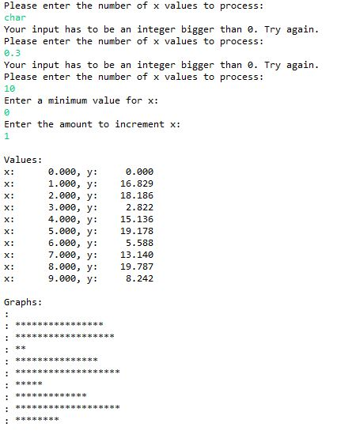
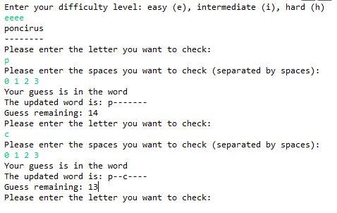
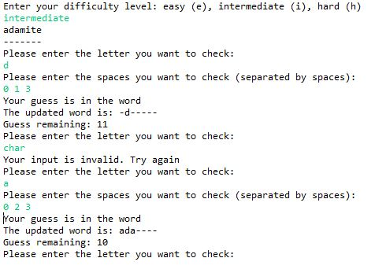
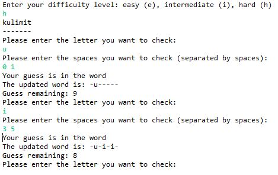
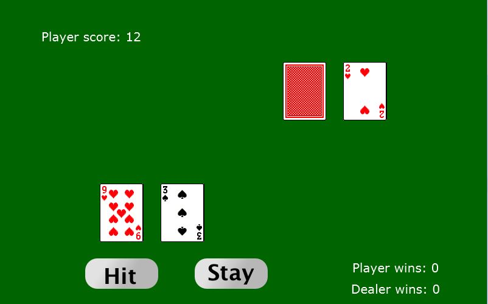
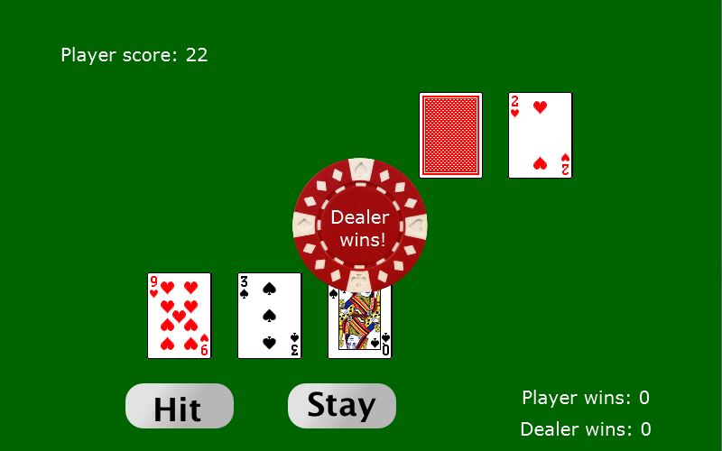
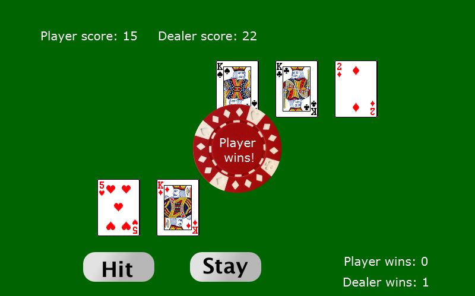

Comprehensive Exam Sample Programming Projects
===============================================

This repo includes three finished sample programming porjects.

### Project 1: StarGraph

This program plots according to function y = sin(x) using asterisks. For detailed information, please click <a href="http://cobweb.cs.uga.edu/~cs1301/files/Lab08.pdf">here</a>.

#### Figure 1. Sample interface, input and output of the program
 

### Project 2: Hangman 2.0

This program creates a word guessing game. For detailed information, please click <a href="http://cobweb.cs.uga.edu/~cs1301/files/Project3.pdf">here</a>.

Sample Input and Output:

#### Figure 2. Sample interface, input and output of the program
 

#### Figure 3. Sample interface, input and output of the program
 

#### Figure 4. Sample interface, input and output of the program
 

### Project 3: BlackJack

This program creates a 21-point game. For detailed information, please click <a href="http://cobweb.cs.uga.edu/~cs1301/files/Spring2015Project05/Project5_Instructions.pdf">here</a>.

#### Figure 5. Sample interface, input and output of the program

#### Figure 6. Sample interface, input and output of the program

#### Figure 7. Sample interface, input and output of the program
